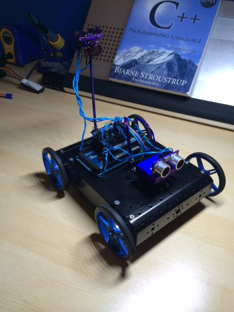

This autonomous rover can produce floorplans of empty buildings. At least he tries to...  The rover uses two ultra-sonic ping sensors to avoid collisions and gauge distance to walls, wheel encoders to track distance traveled, and a magnetometer to track its rotation in world space (though not with a great deal of accuracy thanks to interference). The rover sends the data over a ZigBee network to a base station, where it's used to create a blueprint/floorplan of the space being traversed by the rover.  C++ was used for the rover while the desktop application that rendered the floorplan was written in C# and leveraged the now extinct XNA framework.  

  

  

  

