Yet another IR-based project...  This time I wanted to control my theater using a SNES-style gamepad.  Thanks to conductive tape this project was doable (the space is so tight that even 22/24 guage cable would prevent reassembly of the housing).  

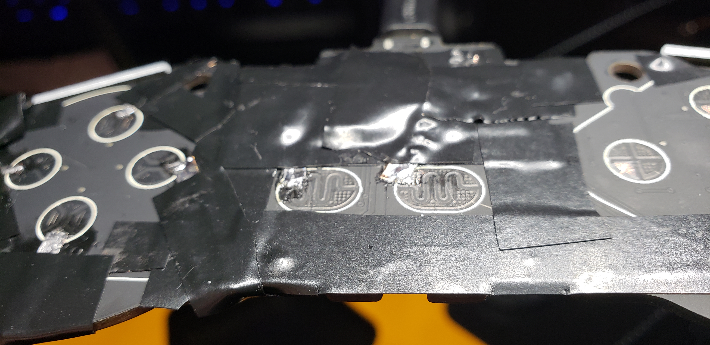  

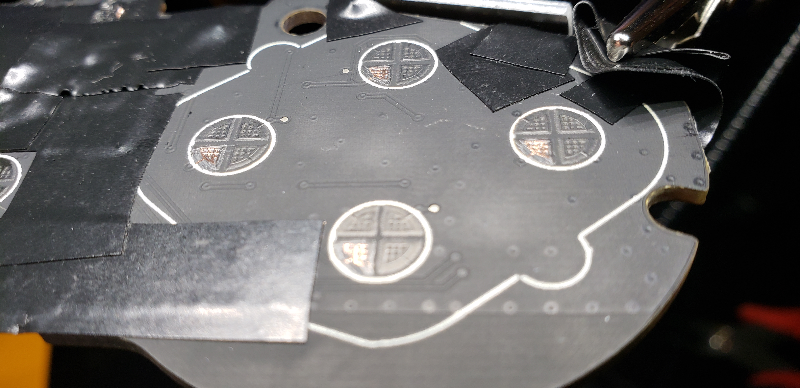  

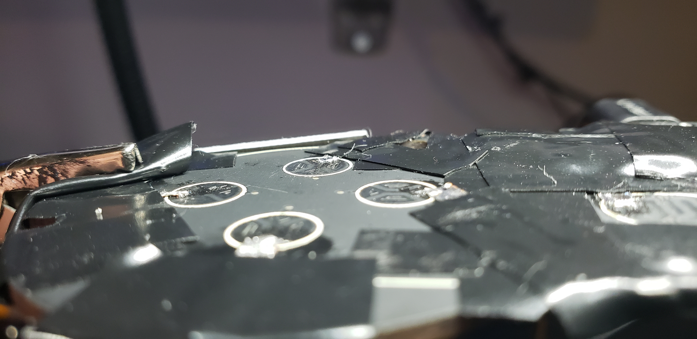  

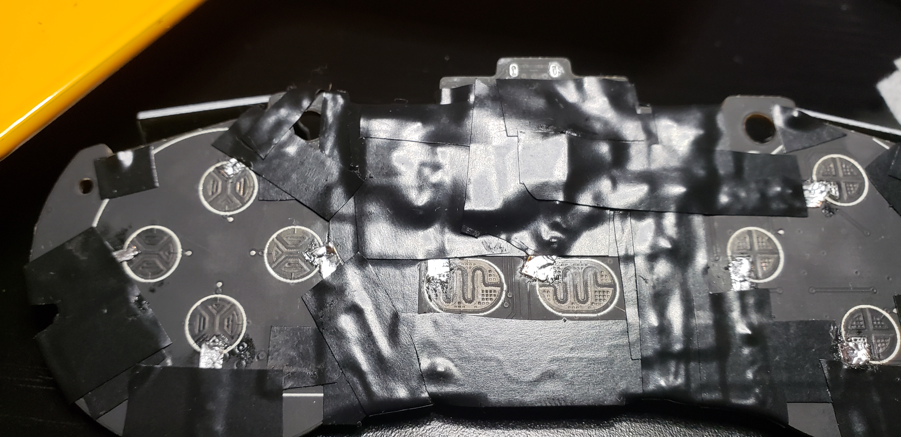  

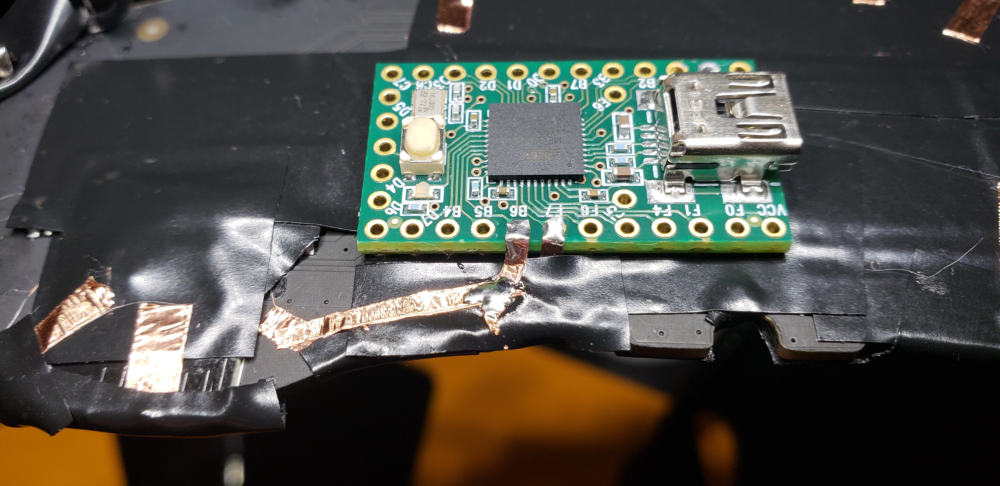  

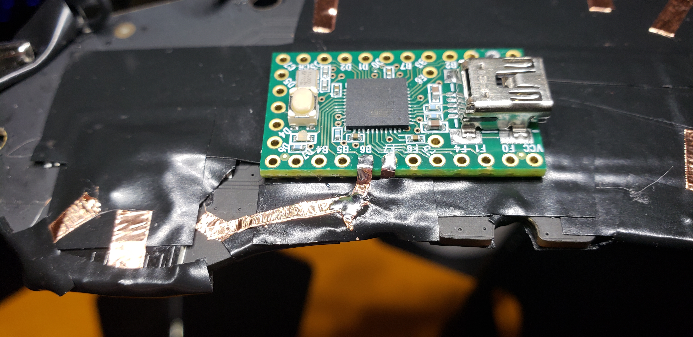  

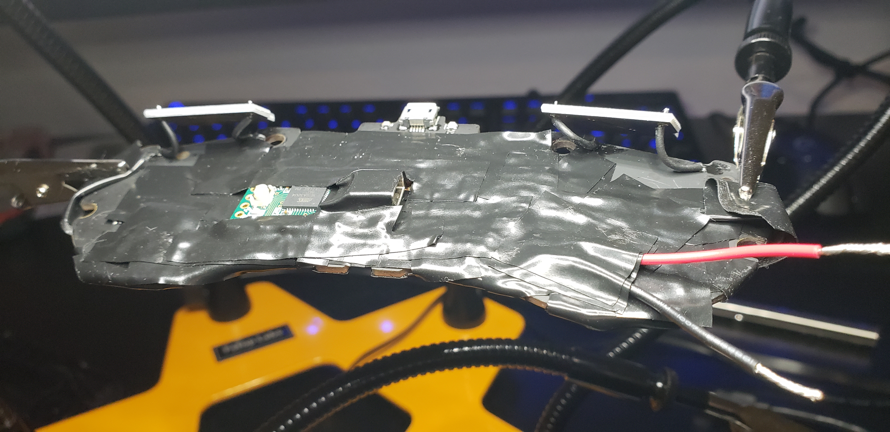  

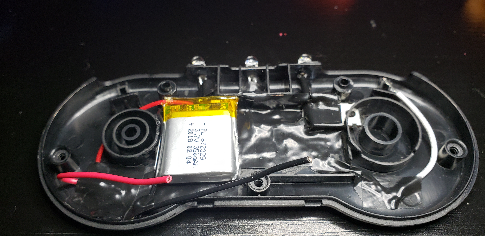  

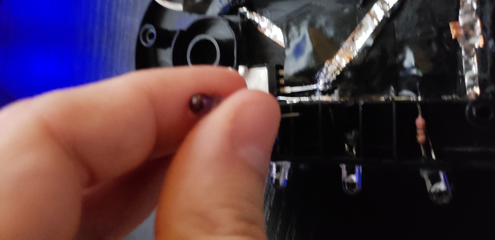  

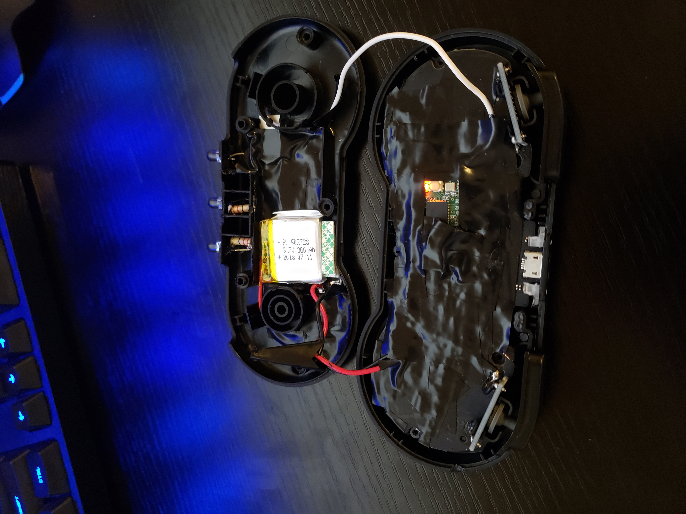  

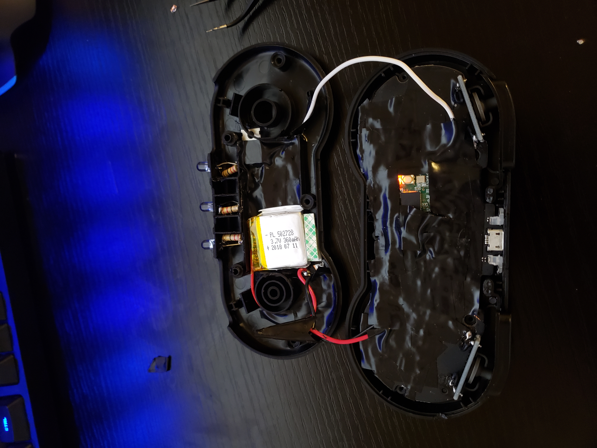  

  

