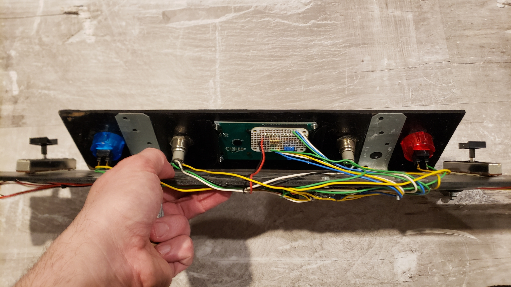

I fell in love with this game and once I learned it was moddable the idea to create a custom joystick came quickly.  Apparently a lot of people also had this idea (unsurprisingly, given the unique control requirements) and their joysticks are far prettier than this one, so don't laugh.  That said, it worked like a champ and fit nicely in front of my keyboard and was easy to remove/store.  

The mod for KSP was written in C# and the joystick's code in C++, as the two boards involved are Arduino-based.  

  

  

  

