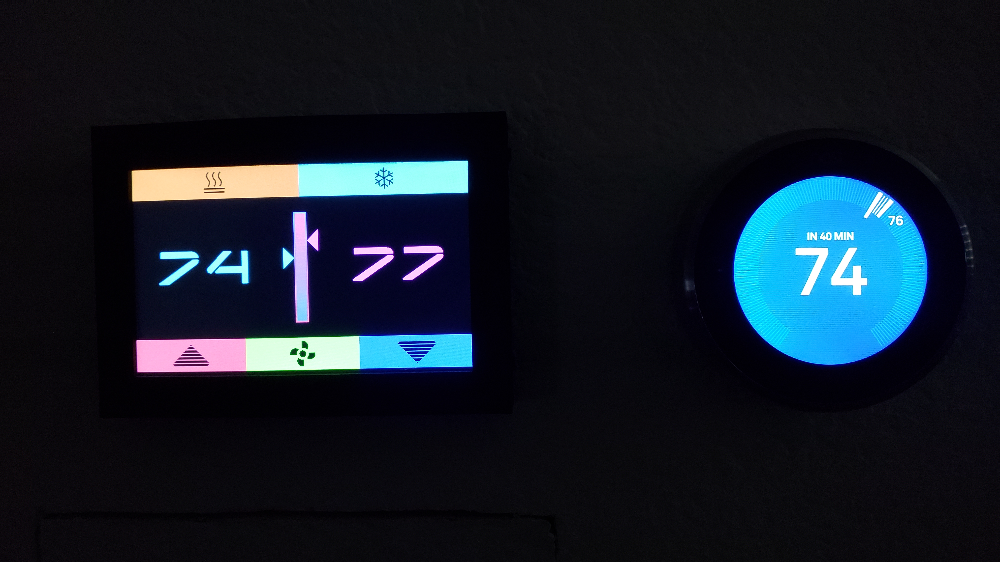

My second 3D-printed project was a custom touchscreen thermostat, also Arduino-based with wifi capability for remote control via an Android app. I used 3ds Max to create the model and you can view a live 3D version of it on shapeways.com:  

https://www.shapeways.com/shops/tonysprints   

"Production" model:  

  

  

  

  

  

  

Prototype:  

  

  

  

  

