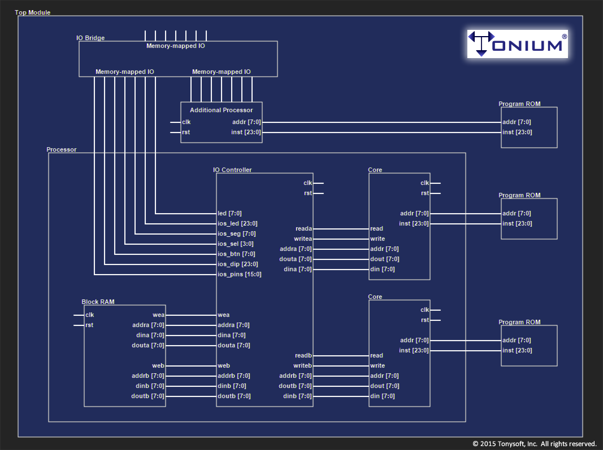
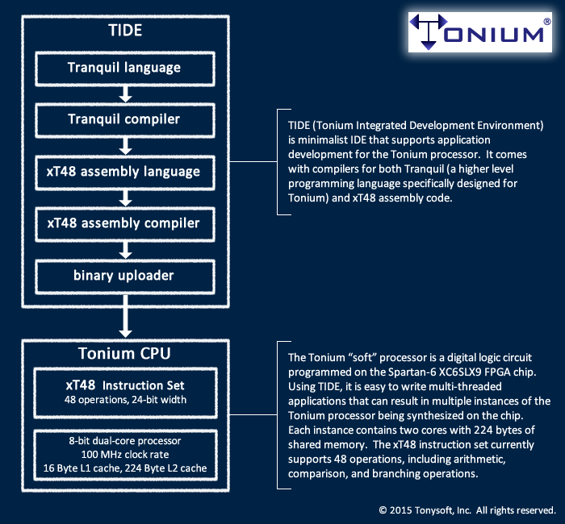

My first project programming a FPGA chip using Verilog.  It's a multi-core, variable speed 8-bit processor that supports 50 instructions...or perhaps some subset thereof.  Unfortunately, it's been several years since I've worked on this project and I can't remember if I ended up implementing all of the instructions. The number of cores synthesized on the FPGA chip is user-configurable, as is the clock rate (up to 125 MHz). Cores can be grouped together for the purpose of sharing block memory (RAM). I designed the assembly language and IDE used to program this processor. The assembly-like language is compiled to Verilog and is then sent to the Xilinx compiler to handle the rest (compile the Verilog and program the FPGA chip).  So far I have been able to synthesize 13 cores running at 125 MHz with no timing issues on the Xilinx Spartan-6 FPGA chip.  

The images below are outdated and don't reflect the latest design.  Hopefully the code is the most recent, however...  
  

  

  

