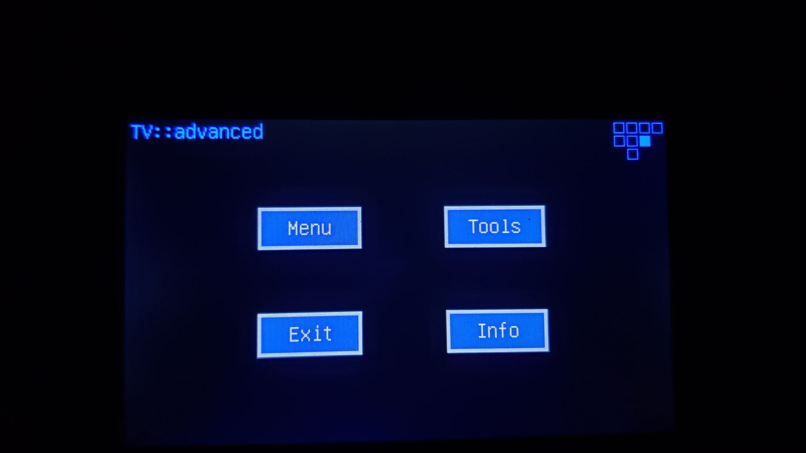

My first 3D-printed project.  It's a universal remote with a touchscreen interface and two thumbsticks. It controlled the audio/video equipment in my living room in a former home along with the lighting. The IR LED’s are powered by a constant-current circuit for maximum range and field-of-view. The UI was built using a framework I developed to make drawing common controls such as buttons, labels, etc., on an Adruino-based platform easier.  

Thankfully my first attempt at having the housing printed was a success, as it cost more than $200 to do so.  The price could have been reduced if I went with a thinner plastic (as opposed to 2mm), but I wasn't willing to redesign the whole thing for that purpose.  I used 3ds Max to create the model.  You can view a live 3D version of it (and even print it, if so inclined) at shapeways.com:  

https://www.shapeways.com/shops/tonysprints  

  

  
  

  

  

  

  

  

  
