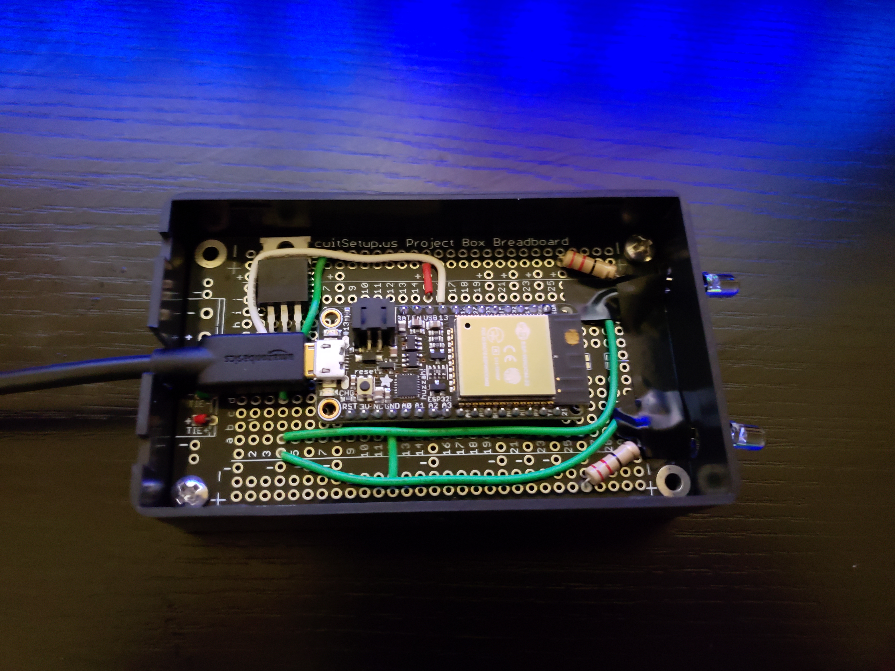

This is an Android app that communicates with a wifi-enabled microcontroller that sat on top of a projector I had in a former home.  The microcontroller waited to receive commands over wifi and it would translate them to IR signals used to control the projector and audio receiver.  I had a second microcontroller sitting inside of the "TV" cabinet where I kept a Roku device and it was aimed directly at it as the Roku supports both IR and wifi-based signals for remote control (however wifi is only for use with their proprietary remote).  

  

