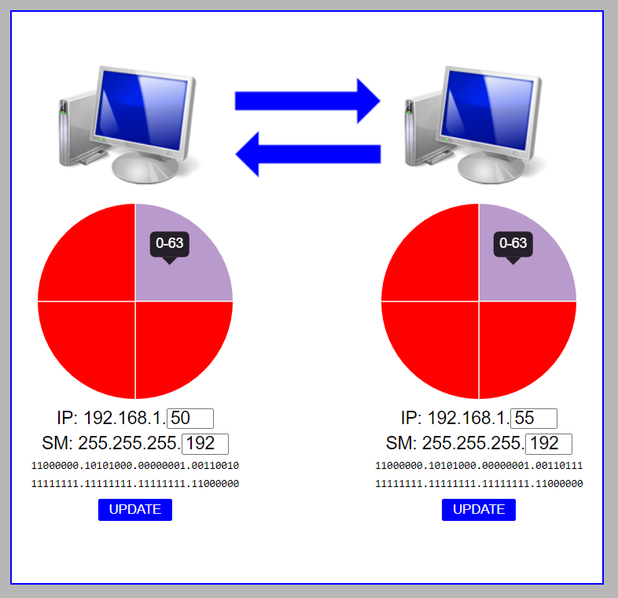
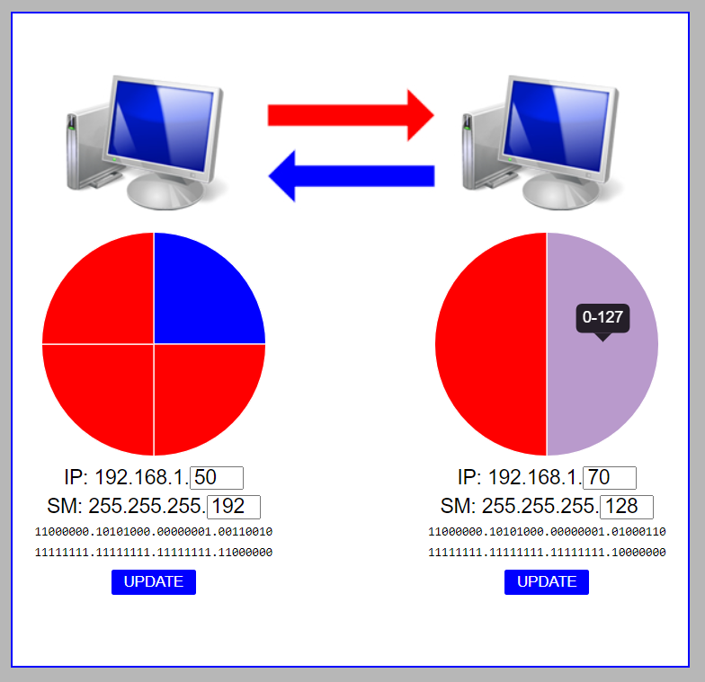

Just a simple single page app I created for a friend that was learning IP addressing, subnets, etc.  You can enter an IP address and subnet mask for either node (limited to Class C subnets) and the arrows will indicate if the packet will make it to the other node.  Blue indicates that the packet will reach the other node while red means it will not.  If TCP is the transport protocol, communication is only possible if both arrows are blue; UDP would work with just one arrow blue, but only in that direction, etc.  Assumes that the two nodes are connected to each other via a switch (no router in between).  

  

  

