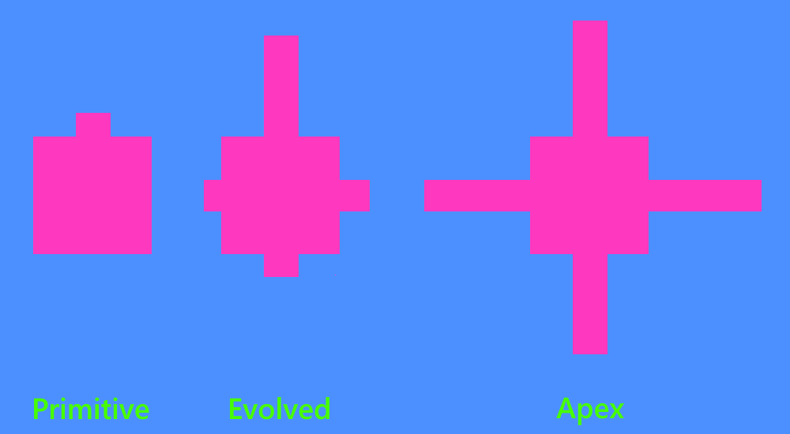
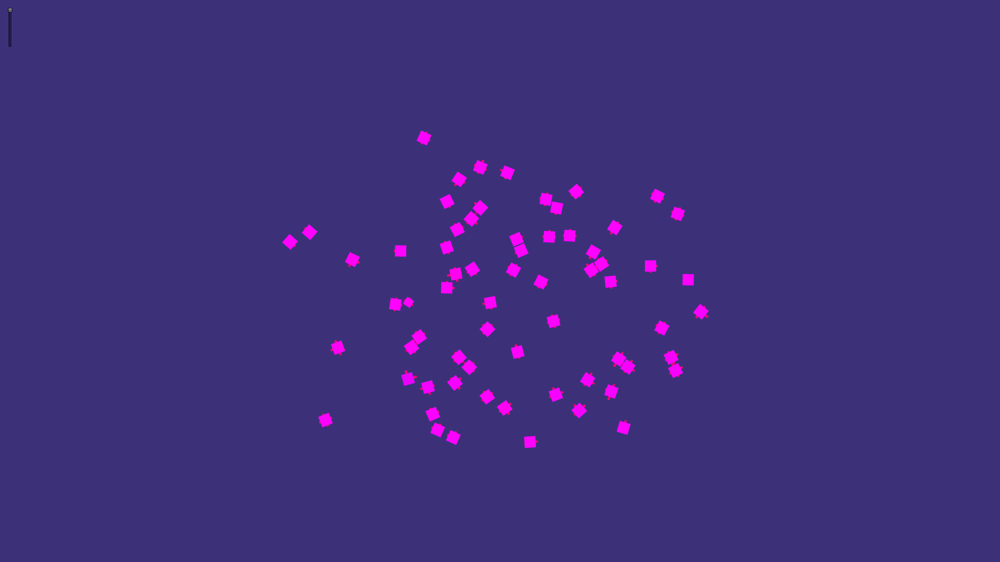
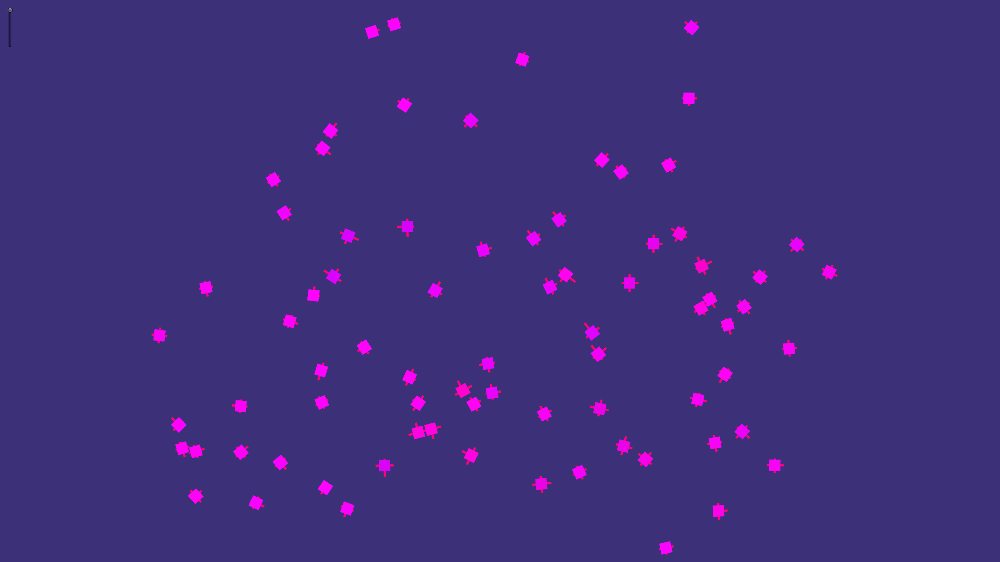
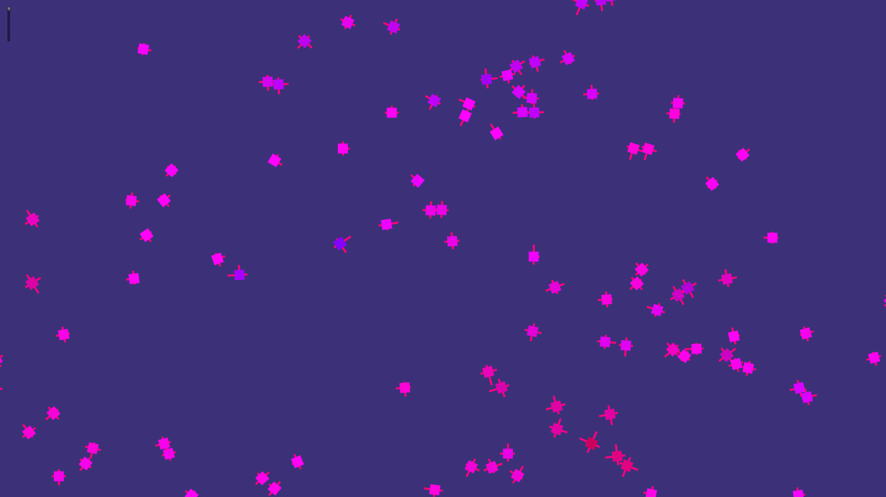
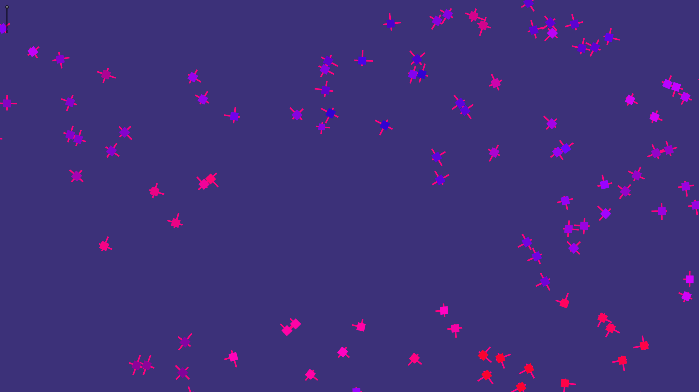
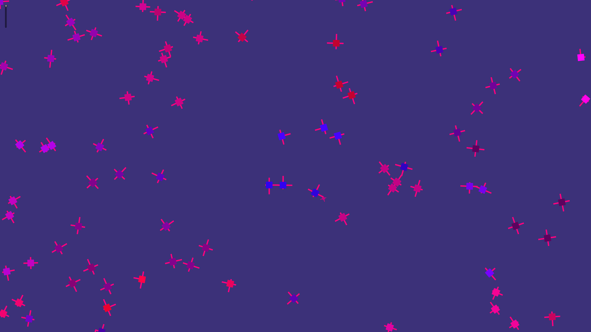
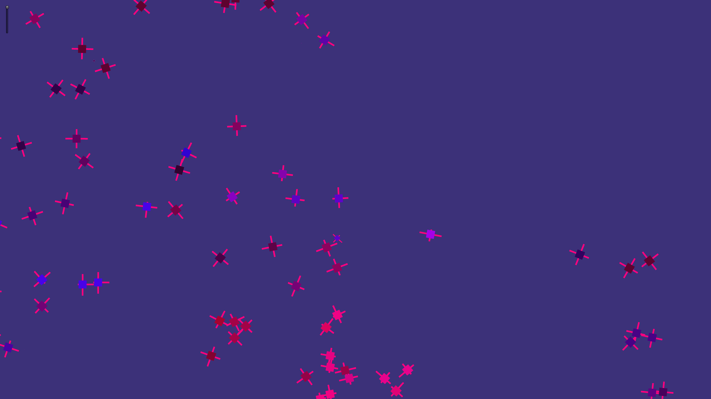
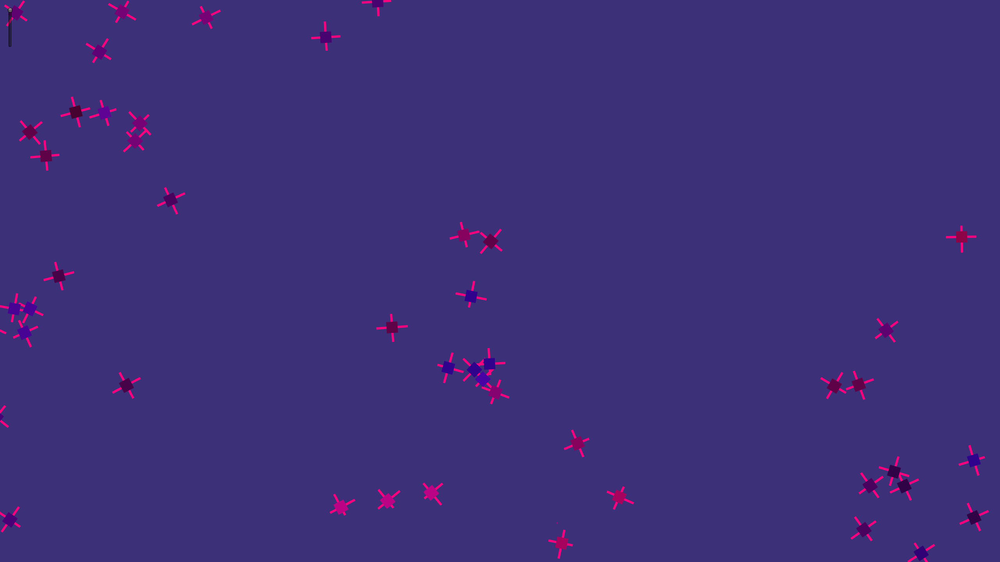

This is a simple demonstration of natural selection.  It simulates dozens to hundreds of life forms (called Quadles) on the screen, rendered as squares/quads of the same size, and each life form can potentially have an arm extend from one of its four sides.  The life forms move about on the screen like small-celled organisms in a petri dish (kind of jittery with no real direction).  

They start out by having only one very short arm (also rendered as a  quad). As time goes on, they have a chance to reproduce (asexually), thereby passing their genes (arm lengths) to their children.  A child node doesn't inherit the exact arm lengths of their parent node, but rather some close approximation there of.  That is, any given arm of the child may be a bit longer or shorter than the matching parent's arm.  

The arms act as weapons, immediately killing any other life form they come in contact with.  For that reason, having longer arms is better as it means you can get the other guy before they get you.  Eventually each life form will die of old age if not killed sooner by another life form.  

What naturual selection teaches us is that over time traits that are more favorable for survival tend to be passed on to subsequent generations, just by virtue of being able to reproduce more if given more time for that to happen.  In this simulation, having longer arms means living longer, thereby giving these horny quads more time to self-love and reproduce.  Indeed, size does matter here. 

So as the simulation progresses, what is observed is that the average arm size of all life forms is significantly longer than when the simulation started.  Additionally, while long, one-armed life forms ruled in the beginning, over more time eventually long, four-armed life forms ended up taking over the universe...and they never even knew that they were living in a simulation, powered by a game engine named Unity.  Even simulated life is not without a sense of irony.  

Update: the various species of Quadles are now differentiated by color!  In order for two Quadles to be of the same species, they must have at least one arm in common (has the same length) and the other matching arms must either be the same length or no bigger/smaller than 1 unit.  Arms are uniquely identified as arm A, arm B, arm C, and arm D, so a Quadle must have, for example, the same arm B length as another Quadle's arm B length while the other matching arms can vary a bit and those two Quadles would be considered the same species.  Quadles of the same species do not kill eachother, much like bacteria or viruses of the same type generally do not either.  Further, I tweaked the algorithm a bit such that there is now an explicit reward for killing: the Quadle gets to live 20 seconds longer (90 seconds is the default time to live before they die of old age).  

  

  

  

  

  

Rise of the apex predator!  This is after the simulation has been running for about 20 minutes at max speed.  

  

If you're patient enough, you will eventually see the apex Quadle become the dominant species...  

  

  

