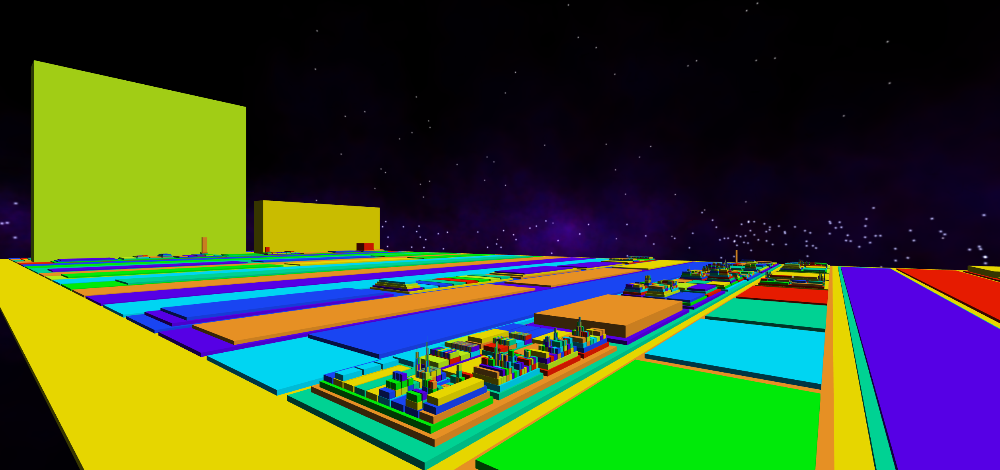
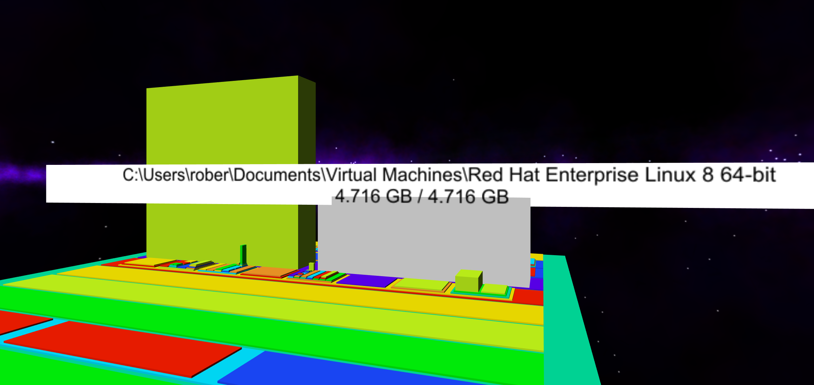

It's WinDirStat, but in 3D/VR.  :)  

  

When you are looking at a folder (indicated as a colored block) and press the A button (on an XBox controller), then that box will be selected (turning gray to indicate as much) and a label will appear above it with the full path of the folder displayed along with the storage space it consumes.  Two numbers are shown, the first being how much storage is consumed by the files directly located within that folder and the second is the total amount of storage consumed by this folder, including the content of all of its subfolders.  

It looks better in VR, but here is a screenshot of what that looks like:  

  